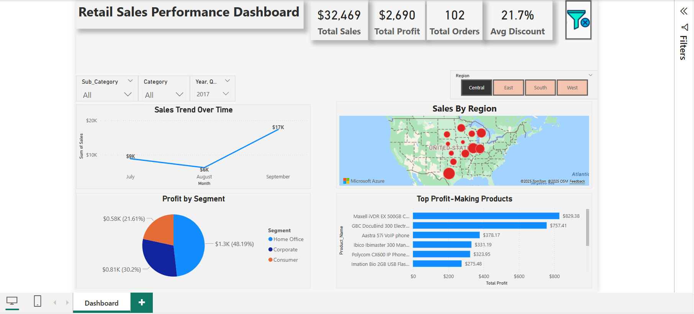

# 🛍️ Retail Sales Analysis Dashboard

A dynamic and interactive **Power BI dashboard** focused on analyzing regional retail sales, profit, discounts, and product performance. This project demonstrates how raw data can be transformed into clear, actionable insights to support decision-making in a retail business.

---

## 📊 Project Overview

**Objective:**  
Analyze retail sales performance across regions, segments, categories, and products to uncover key insights.

**Tool Used:**  
- Microsoft Power BI

**Data Cleaning:**  
- Performed in Microsoft Excel  
- Handled null values  
- Formatted currency columns  
- Cleaned and standardized the profit column

---

## ⭐ Key Features

- **KPIs:** Total Sales, Profit, Orders, Average Discount  
- **Sales by Region:** Map chart with intensity-based color formatting  
- **Category & Sub-Category Analysis:** Clustered bar chart  
- **Sales Trend Over Time:** Line chart with date slicer  
- **Top 10 Products by Profit:** Sorted bar chart with tooltips  
- **Profit by Segment:** Pie chart  
- **Slicers:** Order Date, Region, Segment, Category  

---

## 🧮 DAX Measures Used

```DAX
Total Sales = SUM(Sales[Sales])
Total Profit = SUM(Sales[Profit])
Average Discount = AVERAGE(Sales[Discount])
Total Orders = DISTINCTCOUNT(Sales[Order ID])
```

---

## 🎨 Design & Formatting

- Clean, well-organized layout with clear separation between visuals and slicers  
- Applied conditional formatting to highlight sales intensity by region  
- Used color-coded insights for better readability (e.g., green for high profit, red for low)  
- Included a "Reset Filter" button to enhance user experience and navigation  
- Maintained consistent spacing, font sizes, and alignment across all visual elements  
- Chose appropriate chart types for each insight to ensure clarity and impact

  ## Dashboard Preview

Here’s a preview of the Power BI dashboard:


